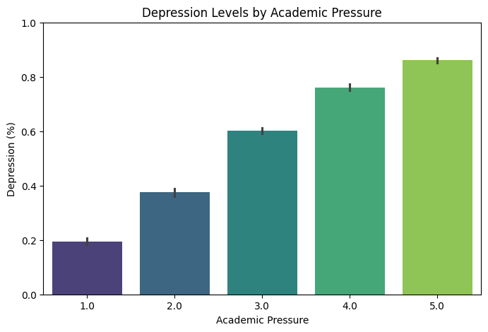
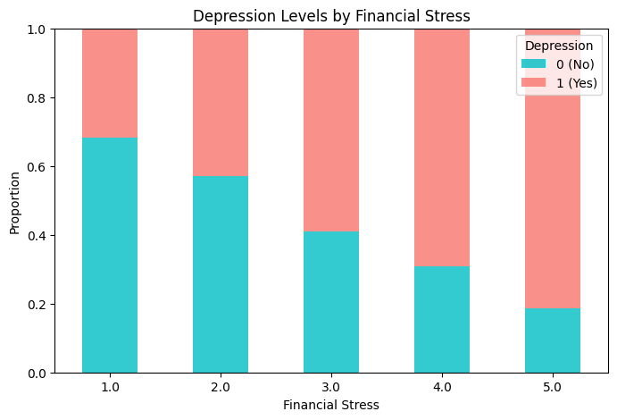
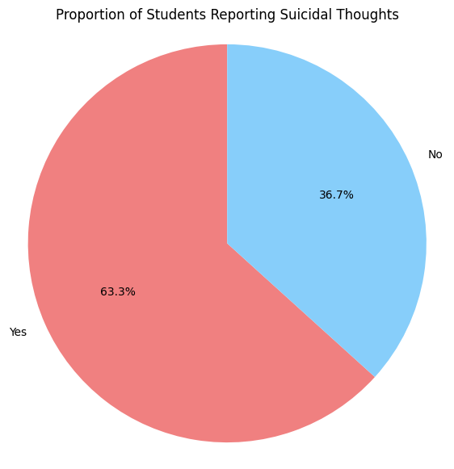

# 📚 Analysis of Factors Influencing Student Mental Health
**Course:** STQD6014 Data Science  
**Project Title:** Analysis of Factors Influencing Student Mental Health: Academic & Work Pressure, Finance, Lifestyle & Diet  
**Student ID:** Adam Suhail Bin Shahril (P153109)

 <!-- Mental health image -->

## 📊 Dataset Background

Hello GitHub enthusiasts! 👋 My name is Adam, and I'm a master's student in Data Science. I chose to explore and analyze this dataset because, as a student myself, I am keenly aware of the challenges we face regarding mental health and academic pressures.

The dataset focuses on the mental health and lifestyle factors of students across various cities in India and contains tens of thousands of records. Each record captures a wide range of demographic, academic, and psychological variables.

You can access the dataset at the following link: [Student Depression Dataset - Kaggle]

### 🔑 Key Attributes

- **Gender:** The gender of the respondents (Male/Female).
- **Age:** The age of the students.
- **City:** The city where the students reside.
- **Profession:** Primarily categorized as 'Student'.
- **Academic Pressure:** Level of academic pressure experienced (scale of 1 to 5).
- **Work Pressure:** Level of work pressure (scale of 0 to 5).
- **CGPA:** Cumulative grade point average of the students.
- **Study Satisfaction:** Rating of study satisfaction (scale of 1 to 5).
- **Job Satisfaction:** Rating of job satisfaction (scale of 0 to 5).
- **Sleep Duration:** Amount of sleep categorized into ranges.
- **Dietary Habits:** Description of dietary habits (e.g., Healthy, Moderate, Unhealthy).
- **Degree:** Degree pursued by the respondents.
- **Suicidal Thoughts:** Indicates if the student has ever had suicidal thoughts (Yes/No).
- **Work/Study Hours:** Number of hours spent on work or study.
- **Financial Stress:** Level of financial stress (scale of 0 to 5).
- **Family History of Mental Illness:** Indicates family history of mental illness (Yes/No).
- **Depression:** Status of depression (0/1 = No/Yes).

This dataset is significant as it highlights the mental health challenges faced by students in India. By analyzing these factors, I hope to contribute to a better understanding of student well-being and foster discussions around necessary support systems in academic environments.

## 🧠 Introduction

In today's fast-paced academic environment, the mental health of students has become an increasingly pressing concern. This analysis aims to explore the relationship between various factors—such as academic pressure, sleep duration, and dietary habits—and their influence on mental health indicators, including depression and suicidal thoughts.

### 🎯 Primary Objectives

- Identify trends in mental health issues among students based on age, gender, dietary habits, and lifestyle factors.
- Examine correlations between academic & work pressure, financial status, study satisfaction, and mental health outcomes.
- Provide insights that can inform support systems and interventions aimed at enhancing student well-being.

## 📉 Problem Statement

The mental health of students has garnered increasing attention, particularly concerning academic pressures and lifestyle choices. This analysis seeks to address key issues related to mental well-being, focusing on how factors like academic & work pressure, financial status, dietary habits, and overall well-being influence mental health outcomes.

### 🔍 Main Problems or Hypotheses

1. **Academic Pressure and Mental Health:** Does a higher level of academic pressure correlate with increased levels of depression and suicidal thoughts among students?

   #### Guiding Questions
   - What is the relationship between academic pressure and reported levels of depression and suicidal thoughts among students?
   - How do students perceive the impact of academic pressure on their mental health?

2. **Impact of Financial Stress:** How does financial status affect students' mental health indicators and overall well-being?

   #### Guiding Questions
   - How does financial pressure correlate with overall mental health and academic performance?
   - Are there patterns of financial stress that emerge when analyzing its effects on mental health?

3. **Impact of Dietary Habits and Lifestyle Choices:** How do dietary habits and lifestyle choices affect students' mental health indicators, including CGPA and study satisfaction?

   #### Guiding Questions
   - How do dietary habits and lifestyle choices correlate with mental health outcomes?
   - What interventions can be implemented to improve students' dietary habits, lifestyle choices, and consequently, their mental health?

By exploring these problems and guiding questions, this analysis aims to provide valuable insights into the mental health challenges faced by students, emphasizing the need for targeted interventions to foster student well-being. 🌟

## 📊 Data Visualizations
Here are the visualizations derived from the analysis:

### Visualization 1

### Visualization 2

### Visualization 3

### Visualization 4

### Visualization 5

These visualizations provide insights into the relationships and distributions of key variables related to student mental health. They help illustrate trends and correlations that can inform support systems and interventions aimed at enhancing student well-being.

## 📋 Conclusion
The analysis of various factors affecting student mental health and academic performance reveals critical insights that highlight the interconnectedness of these elements. The findings underscore the urgent need for comprehensive support systems within educational institutions, addressing not only academic pressures but also mental health, financial stress, dietary habits, and overall student satisfaction. By understanding these relationships, stakeholders can develop targeted interventions to foster a healthier academic environment.

- **Academic Pressure & Financial Stress:** Higher academic pressure and financial status correlate with increased levels of depression, highlighting the need for stress management programs.
- **Dietary Habits and CGPA:** Healthy dietary habits are linked to higher CGPA, suggesting the importance of promoting nutrition among students.
- **Suicidal Thoughts:** A significant 63.3% of students report experiencing suicidal thoughts, indicating a critical need for mental health resources and support systems.
- **Study Satisfaction and Academic Performance:** Higher study satisfaction is associated with better CGPA, emphasizing the need for educational initiatives that enhance student engagement.

## 📄 References
1. Beiter, R., et al. (2015). "The impact of stress on college students' academic performance." *Journal of College Student Psychotherapy*.
2. Huang, L., et al. (2020). "Financial stress and mental health among college students." *Journal of American College Health*.
3. Hackman, J. R., & Oldham, G. R. (1976). "Motivation through the design of work: Test of a theory." *Organizational Behavior and Human Performance*.
4. Hudd, S. S., et al. (2000). "Stress at college: The role of social support." *Journal of College Student Development*.
5. Misra, R., & McKean, M. (2000). "College students' academic stress and its relationship to their anxiety, time management, and leisure satisfaction." *American Journal of Health Studies*.
6. Conley, C. S., et al. (2013). "The role of stress management in student mental health." *Journal of American College Health*.
7. Astin, A. W. (1993). "What Matters in College? Four Critical Years Revisited." *Jossey-Bass*.
8. Benton, S. A., et al. (2013). "Suicidal ideation among college students." *Journal of College Counseling*.
9. Kitzrow, M. A. (2003). "The challenge of student retention." *NASPA Journal*.
10. Eisenberg, D., et al. (2009). "Mental health and academic success in college." *B.E. Journal of Economic Analysis & Policy*.
11. Gonzalez, A., et al. (2015). "The importance of supportive relationships in college student mental health." *Journal of American College Health*.

Thank You!
I would like to extend my heartfelt gratitude to everyone who contributed to this analysis and supported me throughout the process. Your insights, encouragement, and collaboration have been invaluable.
